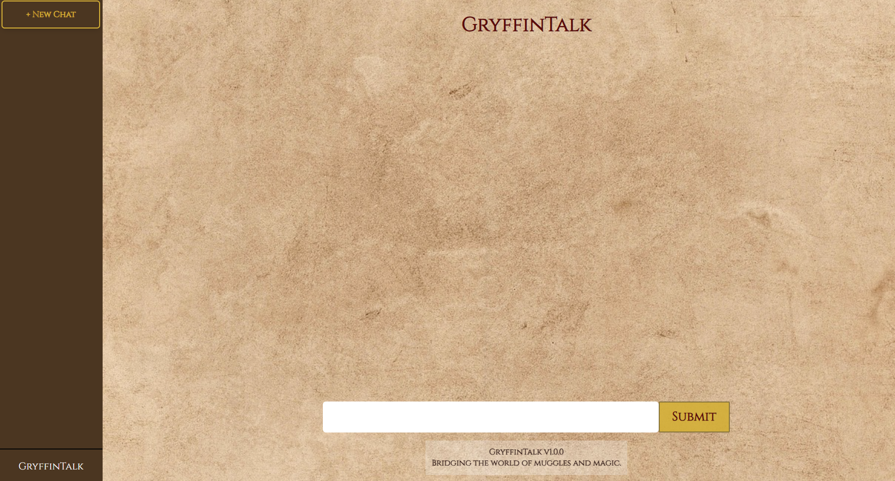

# GryffinTalk
this is a simple harry potter-themed chat app. i built this to learn backend dev and api usage. it's not meant to be super fancy - just a little experiment in react :)

### tech stack:
react, nodejs, hc chat generation api

